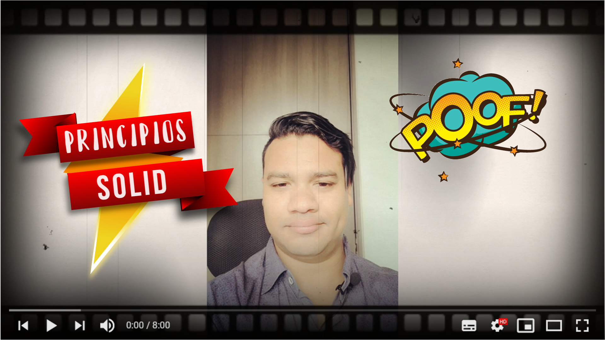

> Este minitutorial se presentará los principios SOLID mediante un practico ejemplo en NetCore/WebApi, para que escribas mejor código que lleve a un software de calidad.

**Nucas pares de aprender, “estudio AUTODIDACTA”.**

# PRINCIPIOS SOLID -MINI CURSO

- S – Single Responsibility Principle (SRP)
https://youtu.be/0kTWBBht5K4 

- O – Open/Closed Principle (OCP)
https://youtu.be/BPuWkYiLPto

-  L– Liskov Substitution Principle (LSP)
https://youtu.be/heHF9lVBSp0

- I – Interface Segregation Principle (ISP)
https://youtu.be/dsAAHfEgvCs

- D – Dependency Inversion Principle (DIP)
 https://youtu.be/7dVrJeCfsaM

## UN POCO DE TEORIA 

### ¿ Software de Calidad ?
- Código mantenible
- Código limpio y entendible
- Código escalable
- Código fácil de testear
- Código reusable

## S – Single Responsibility Principle (SRP)
“Un objeto solo debería tener una única responsabilidad”
¿Cuál es la única razón de cambio?

## O – Open/Closed Principle (OCP)
“Abiertos para su extensión y cerrados para su modificación”
¿Cómo agrego código nuevo, sin modificar el existente?

## L – Liskov Substitution Principle (LSP)
“Objetos de un programa deberían ser reemplazables por instancias de sus subtipos sin alterar el correcto funcionamiento del programa”
El hijo no puede cambiar el comportamiento del padre.

## I – Interface Segregation Principle (ISP)
“Muchas interfaces cliente específicas son mejores que una interfaz de propósito general”
No abusar de las interfaces, divide y vencerás

## D – Dependency Inversion Principle (DIP)
“Depender de abstracciones, no depender de implementaciones”
Inyección de dependencias

